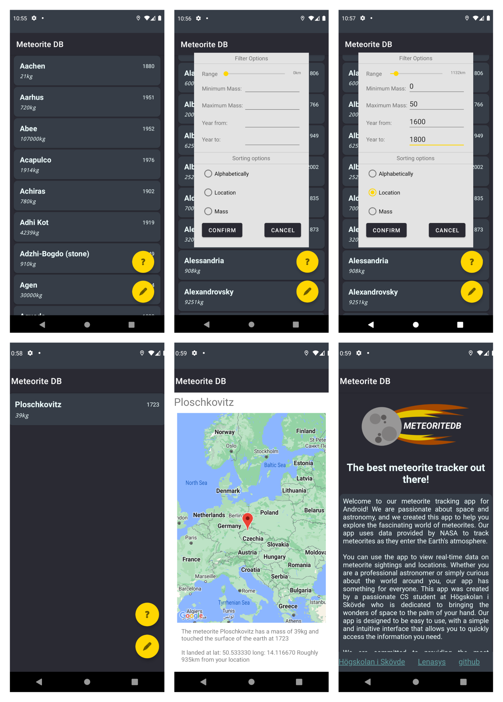

Meteorite DB är en androidapp skapad i Android studio med Java som slutprojekt i kursen
Webbutveckling - Programmering av mobila applikationer (IT396G) vid Högskolan i Skövde.

## Meteorite DB funktioner:
- Data hämtas från en databas via internet. Full kompatiblitet med NASA open api för meteoriter.
- Den data som hämtas visas sedan med hjälp av en dynamisk recyclerview.
- För varje meteorit kan en detaljvy visas med en karta samt en automatisk genererad beskrivning. Notera att det inte finns någon google maps API-nyckel i detta repo.
- Meteoriter kan sorteras och filtreras baserat på vikt, årtal de landat, samt distans från användare med hjälp av ett popupfönster.
- Filter och sortingsval sparas vid omstart av appen.
- Separat "About page" där information visas om appen.
- Snyggt mörkt tema med gula accenter.

**Se resultatet av appen nedan:**

